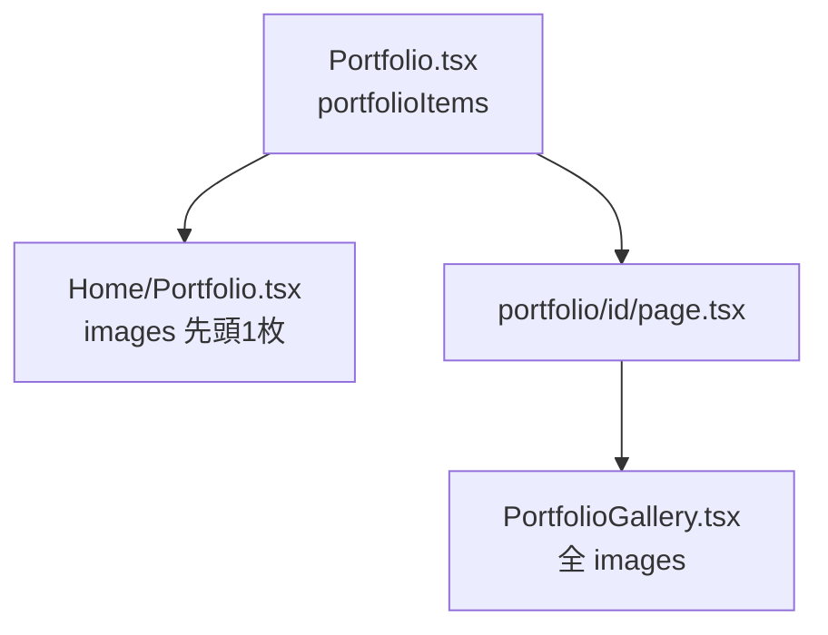

# アーキテクチャ

## 技術スタック

| 項目 | 採用 |
|------|------|
| フレームワーク | Next.js 14（App Router） |
| 言語 | TypeScript |
| スタイル | Tailwind CSS |
| 画像 | `next/image` |
| デプロイ | Vercel（想定） |

## ページ構成

| パス | ファイル | 役割 |
|------|----------|------|
| `/` | `src/app/page.tsx` | トップページ（Profile → Portfolio 一覧 → Hobby） |
| `/portfolio/[id]` | `src/app/portfolio/[id]/page.tsx` | 作品詳細（ビルド時に SSG） |

トップページの Portfolio 見出し（`h2`）は `page.tsx` に配置し、フィルタ・カード一覧は `ProfileSection` の直後に `Home/Portfolio` が描画されます。

## 主要コンポーネント

| ファイル | 責務 |
|----------|------|
| `src/components/Portfolio.tsx` | 作品マスタデータ（`portfolioItems`）、型定義（`Portfolio`, `PortfolioImage`） |
| `src/components/Home/Portfolio.tsx` | 一覧表示、プロジェクト種別フィルタ、会社ごとのグループ表示 |
| `src/components/PortfolioGallery.tsx` | 詳細ページの画像ギャラリー（PC: 縦並び / スマホ: カルーセル） |
| `src/components/ProjectTypeBadges.tsx` | 新規立上げ・改善・リニューアル のバッジ表示 |
| `src/components/Home/ProfileSection.tsx` | プロフィール・職歴 |
| `src/components/Home/Hobby.tsx` | Hobby グリッド + ライトボックス |
| `src/components/Home/images.ts` | Hobby 画像のパス・alt・サイズ |
| `src/lib/portfolioViews.ts` | フィルタ、ソート、会社グループ化 |
| `src/lib/companies.ts` | 会社名の定義と表示順（`COMPANY_ORDER`） |

## データフロー（Portfolio）



- **一覧**: 各作品の `images[0]` のみを 4:3 サムネとして表示
- **詳細**: `images` 配列の全要素をギャラリーで表示

## ソート・グループのルール

`src/lib/portfolioViews.ts` の `comparePortfolios`:

1. `year` の降順（新しい年が上）
2. 同一年なら `sortOrder` の昇順（小さい数字が上）

会社グループは `COMPANY_ORDER`（Cookpad → Cookpad TV → LBOSE → POS+）の順。`company: null` の作品はグループに含まれません。

## 静的アセット

```
public/
├── portfolio/    # 作品画像（PNG 推奨、1024×768 が多い）
└── hobby/        # Hobby 画像（PNG、1024×682）
```

パスは `/portfolio/...` や `/hobby/...` のように、先頭スラッシュ付きでデータに記述します。

## プロジェクト種別

| 値 | 表示ラベル |
|----|-----------|
| `new` | 新規立上げ |
| `improvement` | 改善 |
| `renewal` | リニューアル |

1作品に複数種別を付与可能（`projectTypes` は配列）。

## 複数画像の表示（詳細ページ）

`PortfolioGallery`（`src/components/PortfolioGallery.tsx`）:

| 画面幅 | 挙動 |
|--------|------|
| `md` 以上（PC） | 全画像を縦に並べて表示 |
| `md` 未満（スマホ） | 横スライドのカルーセル（左右タップ・ドット切り替え） |

複数画像がある作品の例:

- `mobile-order` — 3枚（`mobileorder-01` 〜 `03`）
- `onboarding` — 2枚（`onbording-01`, `onbording-02`）

## Hobby のライトボックス

`react-simple-image-viewer` を使用。グリッドの画像クリックで全枚を拡大表示・切り替え可能です（Portfolio 詳細とは別 UI）。
